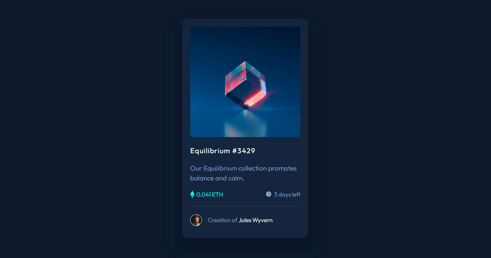

# Frontend Mentor - NFT preview card component solution

This is a solution to the [NFT preview card component challenge on Frontend Mentor](https://www.frontendmentor.io/challenges/nft-preview-card-component-SbdUL_w0U). Frontend Mentor challenges help you improve your coding skills by building realistic projects. 

## Table of contents

- [Overview](#overview)
  - [The challenge](#the-challenge)
  - [Screenshot](#screenshot)
- [My process](#my-process)
  - [Built with](#built-with)
  - [What I learned](#what-i-learned)
  - [Continued development](#continued-development)
- [Author](#author)
- [Acknowledgments](#acknowledgments)

## Overview
- It is a card preview static web page which can be build by HTMl and css 
- Just make sure the page is repsonsive.

### The challenge

Users should be able to:

- View the optimal layout depending on their device's screen size
- See hover states for interactive elements

### Screenshot

## My process
- I simply created Html conetnt first
- Use external stylesheet in my project
- Css grid and flex makes it easy

### Built with

- Semantic HTML5 markup
- CSS custom properties
- Flexbox
- CSS Grid
- Desktop-first workflow
- [Styled Components](https://fonts.googleapis.com/css2?family=Outfit:wght@300;400;600&display=swap) - For google fonts

### What I learned
From this project i learned alot about box shadow and how to use them in effective to make your website components look
awesome. The major lerning you get from this project is how to use perfect combination of colors and font weights.

### Continued development
I personally want to learn  more about color combination and css grid to write less code and make it responsive

## Author

- Website - [Javed](https://ofcl-javed.github.io/findjaved/)
- Frontend Mentor - [@Ofcl-Javed](https://www.frontendmentor.io/profile/Ofcl-Javed)